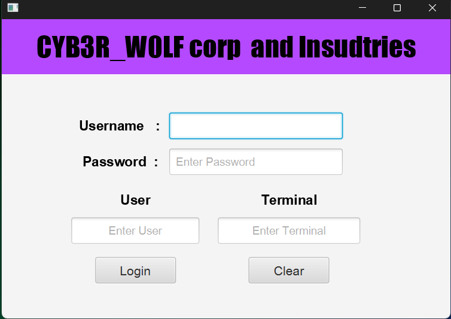
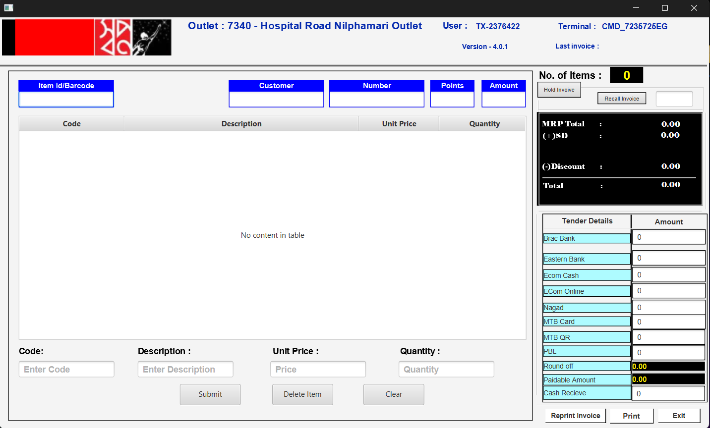
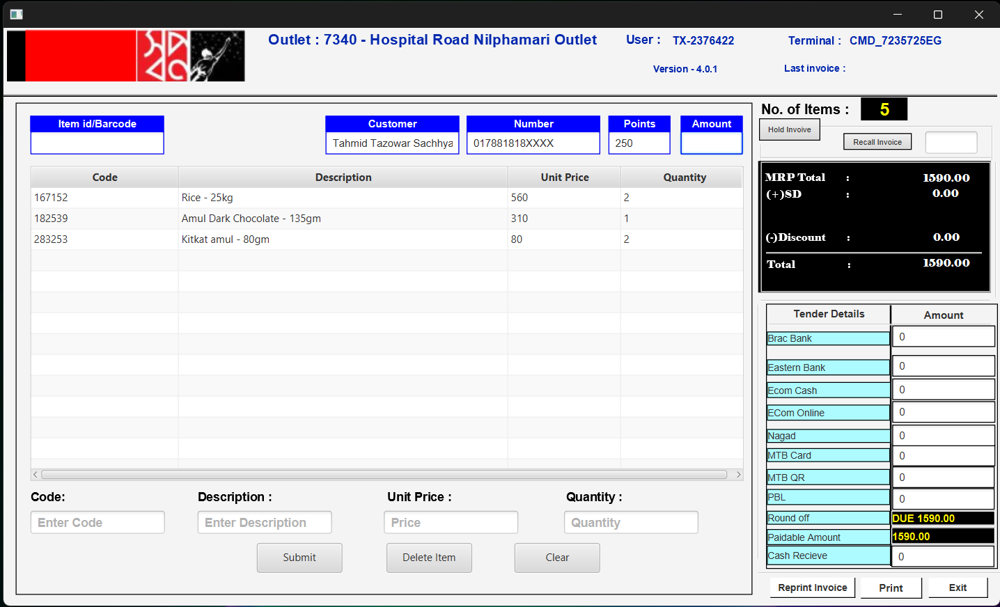
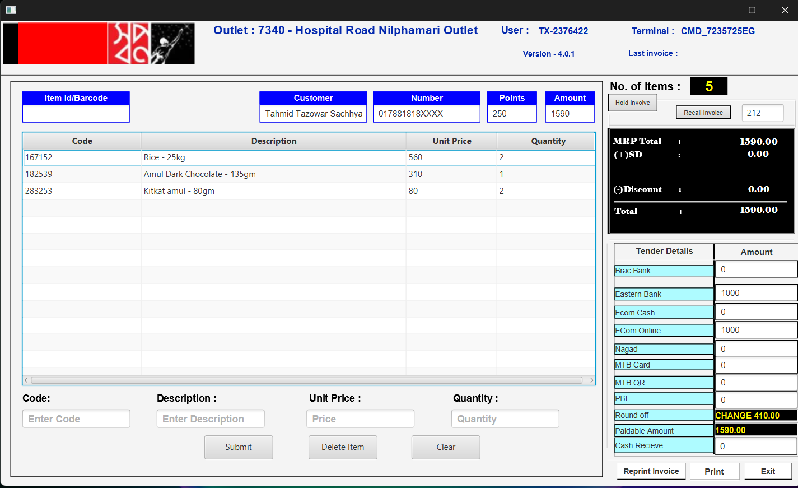

# Swapnoo Super Shop — JavaFX POS System

A desktop-based **Point of Sale (POS) and Sales Invoice Management System** developed using **Java and JavaFX**.

The application is designed for supermarket and retail environments where cashiers can add products, scan barcodes, manage quantities, process multiple payment methods, generate sales invoices, and print receipts. No real payment method or api has been used in the project .

---

## 📌 Project Overview

**Swapnoo Super Shop POS** provides a simple and efficient interface for managing retail sales transactions.

The system allows a cashier to:

* Add products manually
* Scan product barcodes
* Automatically increase product quantity when the same barcode is scanned
* Calculate item count and invoice totals
* Accept multiple payment methods
* Calculate due amount or customer change
* Generate invoice numbers
* Print sales invoices
* Remove selected products from the cart
* Clear the current transaction
* Display cashier/user and terminal information

The project is built with JavaFX and follows a controller-based architecture using FXML for the user interface.

---
## Screen Shot of the project






## ✨ Features

### 🛒 Product Management

* Add products using:

  * Product code/barcode
  * Description
  * Price
  * Quantity
* Prevents invalid or empty product information
* Validates price and quantity
* Automatically merges products with the same barcode
* Supports increasing quantity for existing products
* Remove selected products from the invoice

### 📦 Barcode Scanning

The POS supports barcode scanner input through the barcode text field.

When a barcode is entered and the scanner sends an `ENTER` key:

1. The barcode is read.
2. The product is searched in the current product list.
3. If the product exists, its quantity is increased by one.
4. The invoice totals are recalculated.
5. The barcode field is cleared and focused again.

> **Note:** The current implementation searches products already loaded into the current product list. A database-backed product catalog can be added in a future version.

---

## 💰 Billing & Calculation

The system automatically calculates:

* Total item quantity
* MRP
* Service/SD amount
* Discount
* Total amount
* Payable amount
* Total payment received
* Due amount
* Customer change

The calculation is updated whenever products or payment values change.

### Example

```text
Total Bill       : 1,000.00
Cash Received    :   700.00
Card Payment     :   300.00
--------------------------------
Total Paid       : 1,000.00
Change           :     0.00
```

If the customer pays more than the payable amount:

```text
Total Bill       : 1,000.00
Total Paid       : 1,200.00
--------------------------------
Change           :   200.00
```

If the customer pays less:

```text
Total Bill       : 1,000.00
Total Paid       :   800.00
--------------------------------
Due              :   200.00
```

---

## 💳 Supported Payment Methods

The current application provides fields for multiple payment methods:

> "No real payment method, payment gateway, or payment API has been used or integrated into this project. All payment methods shown in the application are for simulation, testing, and bill calculation purposes only.


| Payment Method    |
| ----------------- |
| Cash              |
| BRAC Bank         |
| Eastern Bank      |
| E-commerce Cash   |
| E-commerce Online |
| Nagad             |
| MTB Card          |
| MTB QR            |
| PBL Bank          |

Payments from all fields are combined automatically to determine the total amount received.

---

## 🧾 Invoice Generation

Every completed transaction receives an invoice number.

The current invoice format is:

```text
INV-1001
INV-1002
INV-1003
...
```

The invoice contains:

* Shop name
* Invoice number
* Date and time
* Cashier/user
* Terminal
* Customer name
* Product code
* Product description
* Product price
* Quantity
* MRP
* SD
* Discount
* Total
* Payable amount
* Individual payment methods
* Total paid
* Change or due amount
* Thank-you message

---

## 🖨️ Invoice Printing

The application uses JavaFX's printing API to print invoices.

Before printing, the system verifies:

* At least one product exists
* The payment is sufficient
* A printer is available

The application opens the system print dialog and sends the generated invoice to the selected printer.

---

## 👤 User & Terminal Information

The POS supports displaying cashier and terminal information.

These values can be assigned using:

```java
setUserAndTerminal(String user, String terminal)
```

The information is also included on printed invoices.

---

## 🗂️ Current Project Structure

A typical project structure can be organized as follows:

```text
swapnoo_super_shop/
│
├── src/
│   └── package/
│       └── swapnoo_super_shop/
│           ├── FXMLDocumentController.java
│           ├── product.java
│           └── ...
│
├── resources/
│   └── FXMLDocument.fxml
│
├── pom.xml / build.gradle
│
└── README.md
```

> The exact structure may differ depending on whether the project uses Maven, Gradle, or a standard JavaFX project configuration.

---

## 🛠️ Technologies Used

| Technology            | Purpose                      |
| --------------------- | ---------------------------- |
| **Java**              | Core application development |
| **JavaFX**            | Desktop GUI                  |
| **FXML**              | User interface layout        |
| **JavaFX TableView**  | Product/cart display         |
| **JavaFX PrinterJob** | Invoice printing             |
| **LocalDateTime**     | Invoice date and time        |
| **ObservableList**    | Product list management      |

---

## ⚙️ Requirements

Before running the project, make sure the following are installed:

* **Java JDK 17+**
* **JavaFX SDK**
* An IDE such as:

  * IntelliJ IDEA
  * Eclipse
  * NetBeans
  * VS Code with Java extensions

A compatible printer is required for physical invoice printing.

---

## 🚀 Getting Started

### 1. Clone the Repository

```bash
git clone https://github.com/your-username/swapnoo-super-shop.git
```

### 2. Open the Project

Open the project in your preferred Java IDE.

### 3. Configure JavaFX

Make sure the JavaFX libraries are correctly configured.

For a modular JavaFX application, the required modules may include:

```text
javafx.controls
javafx.fxml
```

### 4. Run the Application

Run the application's main JavaFX class.

The POS interface should open after successful startup.

---

## 🧑‍💻 Application Workflow

A typical sales transaction follows this workflow:

```text
Start Application
       │
       ▼
Enter / Scan Product
       │
       ▼
Add Product to Cart
       │
       ▼
Update Quantity & Total
       │
       ▼
Select Payment Method(s)
       │
       ▼
Enter Payment Amount
       │
       ▼
Calculate Due / Change
       │
       ▼
Validate Payment
       │
       ▼
Generate Invoice Number
       │
       ▼
Print Invoice
       │
       ▼
Clear Transaction
       │
       ▼
Ready for Next Customer
```

---

## 🔐 Payment Validation

The system prevents an invoice from being printed when the received payment is less than the payable amount.

For example:

```text
Payable Amount : 500.00
Received       : 400.00
Due            : 100.00
```

The application displays an insufficient-payment warning instead of printing the invoice.

---

## 🗑️ Item Removal

The cashier can select an item from the `TableView` and use the delete-item action.

The selected product is removed and:

* Item count is recalculated
* Invoice total is recalculated
* Payment summary is updated

---

## 🧹 Clear Transaction

The **Clear** action resets the current transaction.

It clears:

* Product list
* Customer information
* Payment fields
* Product input fields
* Invoice totals
* Item count
* Barcode field

The barcode field is then focused so the POS is ready for the next transaction.

---

## 🔄 Current & Planned Features

### Implemented

* [x] JavaFX POS interface
* [x] Product entry
* [x] Product validation
* [x] TableView product display
* [x] Barcode scanning workflow
* [x] Automatic quantity increment
* [x] Product deletion
* [x] Item count calculation
* [x] Invoice total calculation
* [x] Multiple payment methods
* [x] Payment validation
* [x] Due calculation
* [x] Change calculation
* [x] Invoice number generation
* [x] Customer information
* [x] User/terminal information
* [x] Invoice printing
* [x] Transaction clearing

### Planned

* [ ] Product database
* [ ] Persistent invoice storage
* [ ] Product inventory management
* [ ] Real barcode/product database lookup
* [ ] Hold invoice
* [ ] Recall invoice
* [ ] Reprint invoice
* [ ] Sales history
* [ ] Daily sales report
* [ ] User authentication
* [ ] Role-based access control
* [ ] Stock management
* [ ] Customer database
* [ ] Discount management
* [ ] Tax/SD configuration
* [ ] Database backup and restore
* [ ] Professional thermal receipt format
* [ ] Dashboard and sales analytics

---

## 🗄️ Future Database Architecture

For a production-ready POS system, the application can be extended with a relational database such as MySQL or PostgreSQL.

A possible database structure:

```text
Users
 ├── user_id
 ├── username
 ├── password
 └── role

Products
 ├── product_id
 ├── barcode
 ├── name
 ├── price
 └── stock_quantity

Invoices
 ├── invoice_id
 ├── invoice_number
 ├── customer_id
 ├── user_id
 ├── terminal
 ├── total_amount
 ├── paid_amount
 └── created_at

Invoice_Items
 ├── invoice_item_id
 ├── invoice_id
 ├── product_id
 ├── quantity
 └── unit_price

Payments
 ├── payment_id
 ├── invoice_id
 ├── payment_method
 └── amount
```

This would allow the application to move from an in-memory POS prototype to a complete retail management system.

---

## 📋 Validation & Error Handling

The application provides validation for common input errors, including:

* Missing product information
* Invalid price
* Invalid quantity
* Zero or negative price
* Zero or negative quantity
* Unknown barcode
* Empty invoice
* Insufficient payment
* Missing printer

User-friendly JavaFX alerts are displayed when validation fails.

---

## 🎯 Project Goals

The main goals of the project are to provide:

1. A simple cashier-friendly interface
2. Fast product entry
3. Barcode-based checkout
4. Multiple payment support
5. Accurate billing calculations
6. Reliable invoice printing
7. A foundation for a complete supermarket management system

---

## 🔮 Future Vision

The long-term goal is to evolve **Swapnoo Super Shop POS** into a complete retail management platform containing:

```text
                    SWAPNOO SUPER SHOP
                           │
          ┌────────────────┼────────────────┐
          │                │                │
          ▼                ▼                ▼
        POS             Inventory        Customers
          │                │                │
          ▼                ▼                ▼
      Payments          Products         Customer DB
          │                │
          ▼                ▼
       Invoices          Stock
          │
          ▼
      Sales Reports
```

The system can eventually support multiple terminals, multiple cashiers, centralized inventory, sales reporting, and database-backed transaction management.

---

## 👨‍💻 Development Notes

The main controller currently manages:

* UI initialization
* Product entry
* Barcode scanning
* Cart management
* Payment processing
* Invoice calculation
* Invoice generation
* Printing
* Transaction clearing

For future maintainability, larger functionality can be separated into dedicated service classes, for example:

```text
controller/
    FXMLDocumentController.java

model/
    Product.java
    Invoice.java
    InvoiceItem.java
    Payment.java
    User.java

service/
    ProductService.java
    InvoiceService.java
    PaymentService.java
    PrintService.java

repository/
    ProductRepository.java
    InvoiceRepository.java
    UserRepository.java
```

This separation would make the application easier to test, maintain, and scale.

---

## 📄 License

This project is currently intended for educational and development purposes.

If this project is released publicly, add an appropriate license such as **MIT**, **Apache 2.0**, or another license that matches the project's requirements.

---

## 📞 Support & Contributions

Contributions, suggestions, and improvements are welcome.

If you find a bug or have an idea for a new feature, please open an issue in the project repository.

For larger changes, create a separate branch and submit a pull request.

---

## ⭐ Acknowledgment

Built with **Java + JavaFX** for retail point-of-sale management.

**Swapnoo Super Shop POS**
*Simple • Fast • Reliable*
